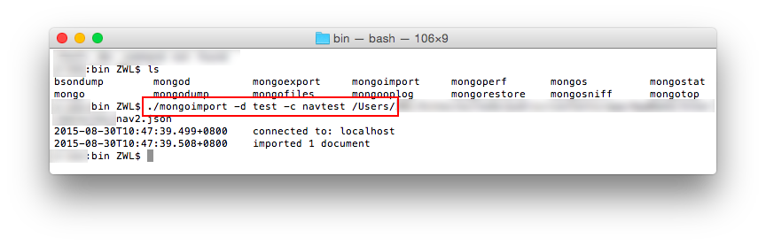

## Mongodb 导入JSON

### mongoimport 导入

mongodb内置了导入功能,我们可以轻松的导入`json`到文档中

以下示例导入一份`json`到`test`数据库的`navtest`文档中:

> `./mongoimport -d test -c navtest /usr…/nav2.json`

  

### mongoexport 导出

导出

> `./mongoexport -d zios -c osapps -o /Users/../data.json`

-d: 导出的数据库

-c: 导出的集合

-o: 导出的文件名